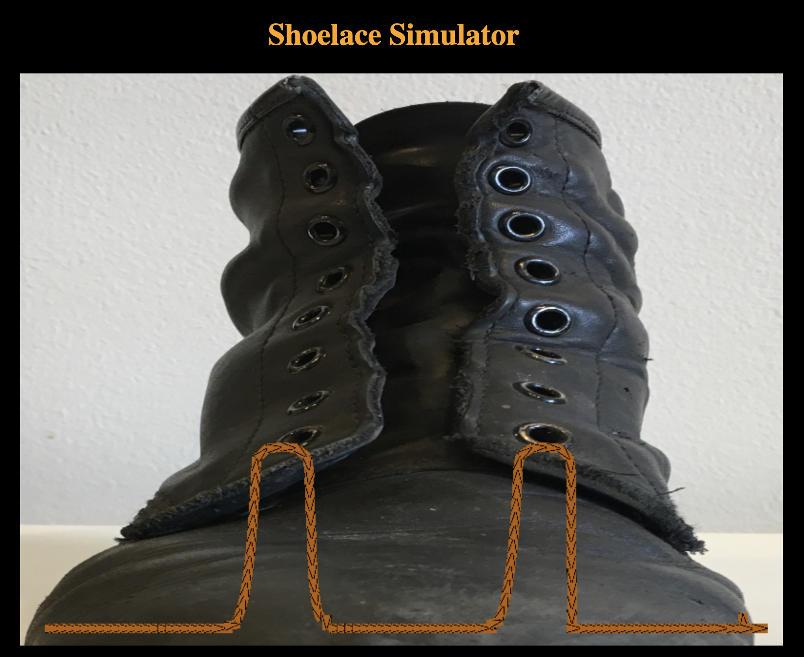

# Shoe Lace Simulator

Shoe Lace Simulater is a game made with Jascript and Phaser.io. Use the mouse to attempt 
to relace Kobe's shoe, as he can no longer do it.

## Technologies Used

* HTML
* JavaScript
* CSS
* Phaser.io

